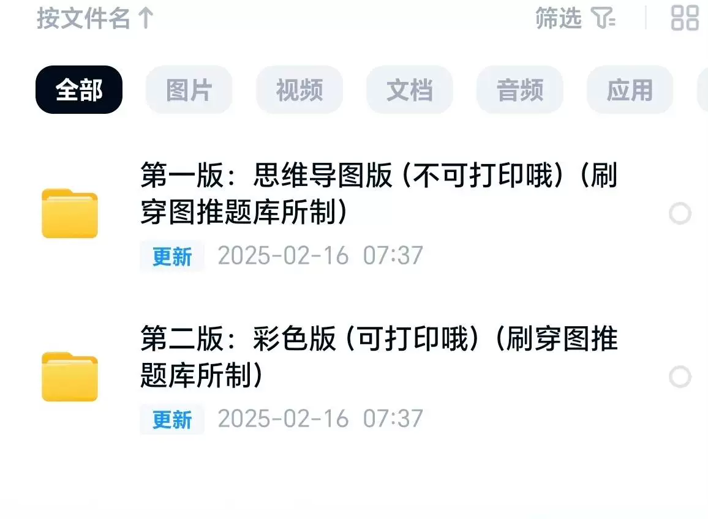
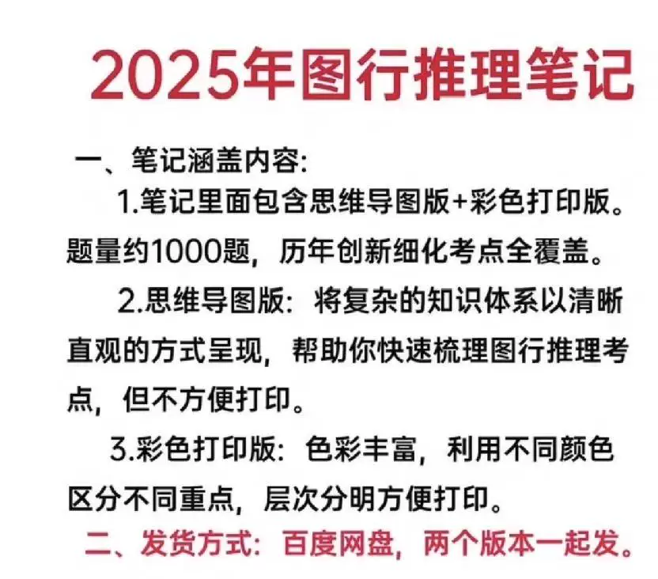
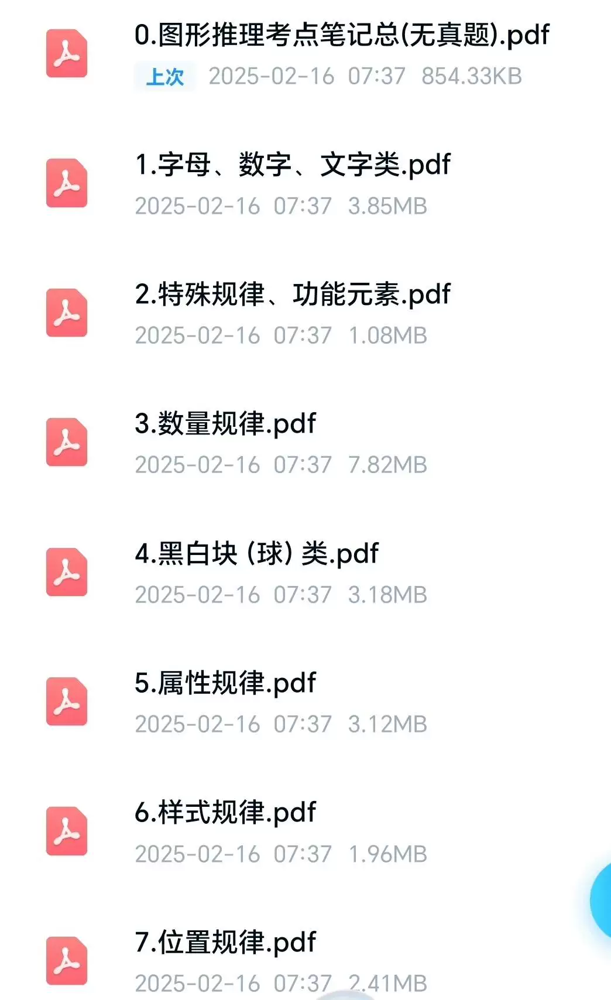
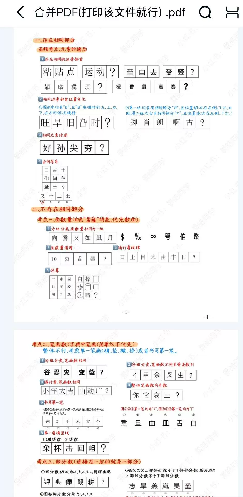
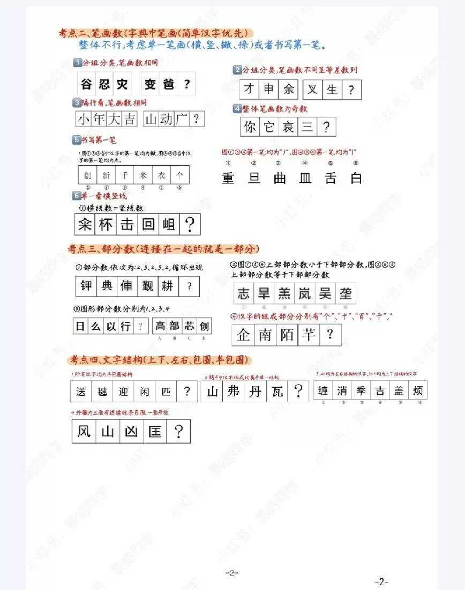
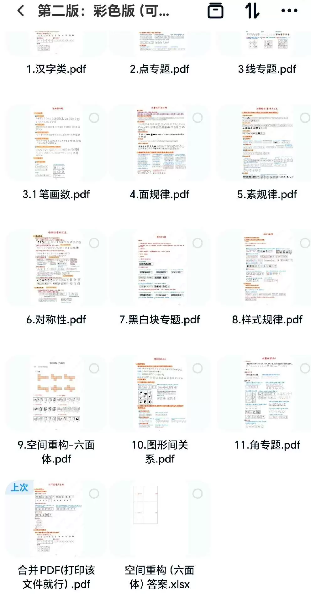

# 1. Use the search function to quickly find notes or concepts you need.
2. Create a folder structure for your notes to make them easier to organize and find.
3. Use the highlighting feature to mark important information in your notes.
4. Use the annotation feature to add notes, questions, or explanations to your notes.
5. Use the sharing feature to collaborate with classmates or friends on your notes.
6. Use the export feature to save your notes as PDF or Word files for easy sharing or printing.
7. Use the sync feature to keep your notes updated across all devices.
8. Use the review feature to review your notes and improve your understanding of the material.

## Body

[Notes from Graphic Tutor] The notes I have compiled from the graph-based tutoring of the Certiport question bank.
[Notes from Graphic Tutor] The notes I have compiled from the graph-based tutoring of the Certiport question bank.
[Notes from Graphic Tutor] The notes I have compiled from the graph-based tutoring of the Certiport question bank.

[Notes Organized by Pushing Through the Pencil Tutorial] The notes I've compiled from brushing through the pencil question bank.

This allows you to quickly grasp the concept of graph induction, saving everyone's time and efficiently preparing for exams. Graph induction can be solved with two graphs!

Pull out the double disk: gyro + accelerometer

[Sending Flowers] Notebook divided into mind map version (including sub-images and summary)

(a) and color print editions (including sub-figures and summary figures).

The update is complete. It will be sent together with the purchase, and free updates will be provided later on.

[Sending Flowers] All items not sold by this account are pirated, and pirated products will not be updated.

Please update the package. Support the original version, thank you all.

[Sending Flowers] Notes are in electronic format, and there is no support for return without a reason after shipment.

Please don't hesitate to contact me if you have any questions. I will ship the goods immediately upon receiving your order, thanks to our automatic shipping system.

## Images

## Payment

Here is a pay link on Stripe ( https://buy.stripe.com/3cs8yP7sY87d0vu9AB ). Please contact me lonlonago@foxmail.com after funding $89, and I will send you a complete data files , thank you!

